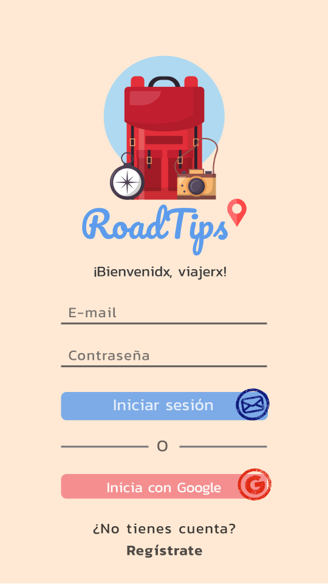
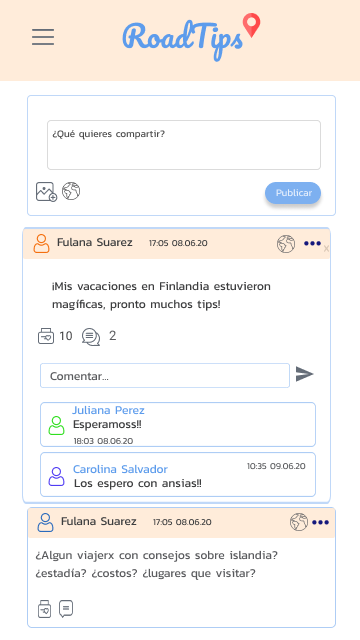
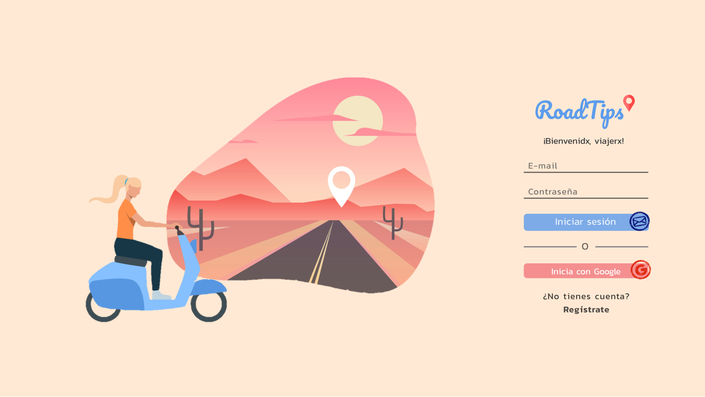
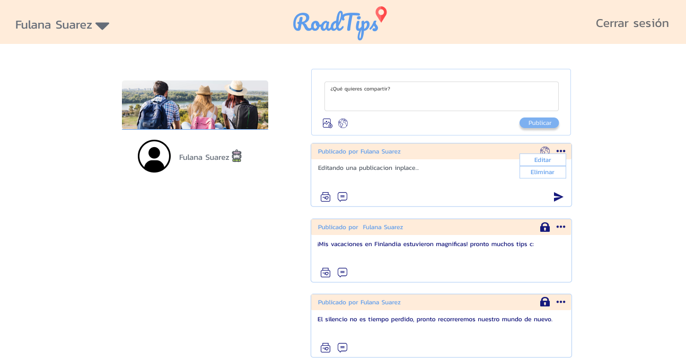

# Creando una Red Social

#### Arquitectura de la aplicación

* Vista mobile

    
    

* Vista Desktop

    
    

## Historias de Usuario

* Como usuario nuevo debo poder crear una cuenta con email y password válidos para poder iniciar sesion e ingresar a la red social.

* Como usuario nuevo debo poder tener la opción de iniciar sesión con mi cuenta de Google o Facebook para ingresar a la red social sin necesidad de crear una cuenta de email válido.

* Como usuario loggeado debo poder crear, guardar, modificar en el mismo lugar (in place) y eliminar una publicación (post) privada o pública, que puede ser una frase o una imagen.

* Como usuario loggeado debo poder ver todos los posts públicos y privados que he creado hasta ese momento, desde el más reciente hasta el más antiguo, así como la opción de poder cambiar la configuración de privacidad de mis post.

* Yo como usuario loggeado, puedo dar like y llevar un conteo de likes en mi publicación así como poder escribir, guardar, editar o eliminar un comentario en mi publicación.

* Al final debo poder ingresar a la red social y poder visualizar los datos de mi perfil creado o editarlos.

* Te dejamos un ejemplo de cómo definir criterios de aceptación y definiciones de terminado para una H.U. Si se te complica definirlas o no tienes idea de que considerar para cada H.U. es de gran ayuda revisar redes sociales como `facebok`, `twitter`, `instagram`, `devopedia` o la red social que más te guste y puedas evaluar qué consideran en cada funcionalidad para darla como terminada y aceptada.

    > Como usuario nuevo debo poder crear una cuenta con email y password para 
    > poder iniciar sesion. Por otro lado, necesito también tener la opción de 
    > iniciar sesión con mi cuenta de Google o Facebook.
    >
    > **Criterios de aceptación**
    > - Si el mail o password no es válido, al momento de logearme, debo poder 
    >   ver un mensaje de error.
    > - Debe ser visible si hay algún mensaje de error.
    > - Debo poder ver esta página de creación en Móviles y desktop (responsive). 
    > - No debe necesitar recargar la página para crear una cuenta (SPA).
    >
    > **Definición de terminado**
    > - La funcionalidad cumple satisface los criterios de aceptación.
    > - La funcionalidad tiene _test unitarios_.
    > - El diseño visual corresponde al prototipo de alta fidelidad.
    > - El código de esta funcionalidad recibió code review.
    > - La funcionalidad esta desplegada y pública para ser probada. 
    > - La funcionalidad fue probada manualmente.
    > - Se hicieron pruebas de usuabilidad y se implementó el feedback si se 
    >   consideró necesario.

## Objetivos de aprendizaje

Antes de empezar el proyecto, recuerda agregar tus objetivos de aprendizaje pendientes de tu proyecto
anterior en la siguiente sección.

### Objetivos de aprendizajes pendientes

### HTML y CSS

* [x] [HTML semántico](https://developer.mozilla.org/en-US/docs/Glossary/Semantics#Semantics_in_HTML)
* [x] [CSS `flexbox`](https://css-tricks.com/snippets/css/a-guide-to-flexbox/)
* [x] Construir tu aplicación respetando el diseño realizado (maquetación).

### DOM y Web APIs

* [x] [Manipulación dinámica del DOM](https://developer.mozilla.org/es/docs/Referencia_DOM_de_Gecko/Introducci%C3%B3n)
* [ ] [History API](https://developer.mozilla.org/es/docs/DOM/Manipulando_el_historial_del_navegador)
* [ ] [`localStorage`]

### Javascript

* [x] [Uso de callbacks](https://developer.mozilla.org/es/docs/Glossary/Callback_function)
* [ ] [Consumo de Promesas](https://scotch.io/tutorials/javascript-promises-for-dummies#toc-consuming-promises)
* [x] Uso ES modules
([`import`](https://developer.mozilla.org/en-US/docs/Web/JavaScript/Reference/Statements/import)
| [`export`](https://developer.mozilla.org/en-US/docs/Web/JavaScript/Reference/Statements/export))

### Firebase

* [x] [Firestore](https://firebase.google.com/docs/firestore)
* [x] [Firebase Auth](https://firebase.google.com/docs/auth/web/start)
* [ ] [Firebase security rules](https://firebase.google.com/docs/rules)
* [ ] [Uso de onSnapshot](https://firebase.google.com/docs/firestore/query-data/listen)
| [onAuthStateChanged](https://firebase.google.com/docs/auth/web/start#set_an_authentication_state_observer_and_get_user_data)

### Testing

* [x] [Testeo de tus funciones](https://jestjs.io/docs/es-ES/getting-started)
* [ ] [Testeo asíncrono](https://jestjs.io/docs/es-ES/asynchronous)
* [ ] [Mocking](https://jestjs.io/docs/es-ES/manual-mocks)

### Colaboración en Github

* [x] Branches
* [x] Pull Requests
* [ ] Tags

### Organización en Github

* [x] Projects
* [x] Issues
* [x] Labels
* [x] Milestones

### Buenas prácticas de desarrollo

* [x] Modularización
* [x] Nomenclatura / Semántica
* [x] Linting

***

## Recursos

### Mobile first

El concepto de [_mobile first_](https://www.mediaclick.es/blog/diseno-web-responsive-design-y-la-importancia-del-mobile-first/)
hace referencia a un proceso de diseño y desarrollo donde partimos de cómo se ve
y cómo funciona la aplicación en un dispositivo móvil primero, y más adelante se
ve como adaptar la aplicación a pantallas progresivamente grandes y
características específicas del entorno desktop. Esto es en contraposición al
modelo tradicional, donde primero se diseñaban los websites (o webapps) para
desktop y después se trataba de _arrugar_ el diseño para que entre en pantallas
más chicas. La clave acá es asegurarse de que desde el principio diseñan usando
la vista _responsive_ de las herramientas de desarrollador (developer tools) del
navegador. De esa forma, partimos de cómo se ve y comporta la aplicación en una
pantalla y entorno móvil.

### Autenticación y autorización

Hasta el momento, los proyectos han sido pensados como recursos públicos, donde todos
los usuarios compartían un mismo rol y la misma información.

En este proyecto tendrás que diferenciar la información a mostrar y modificar,
dependiendo de la identidad del usuario.
De la misma manera deberás crear reglar de autorización para el acceso a los
datos.

Para esto utilizaras respectivamente
[`Firebase authentication`](https://firebase.google.com/docs/auth/) y
[`Firestore security rules`](https://firebase.google.com/docs/firestore/security/get-started)

### CSS

En este proyecto queremos que ganes confianza y experiencia con CSS profesional,
por eso usarás [`flexbox`](https://css-tricks.com/snippets/css/a-guide-to-flexbox/)
para posicionar tus elementos.

Recuerda que no puedes usar frameworks CSS, sólo *vanilla css* o [*sass*](https://sass-lang.com/).

### Otras:

* [Pildora SPA](https://www.loom.com/share/fa63a8ad0e9a43428222c15b6f6613d3)
* [Repositorio de pildora de SPA](https://github.com/betsyvies/bootcamp-spa)
* [Pildora de mock Firebase](https://www.youtube.com/watch?v=06myVn41OTY&t=1s)
* [Repositorio de pildora de mock Firebase](https://github.com/Danielalab/2018-2-Testing)
* [Pildora MVC](https://github.com/merunga/todomvc-vanillajs)
* [Modulos: Export](https://developer.mozilla.org/es/docs/Web/JavaScript/Referencia/Sentencias/export)
* [Modulos: Import](https://developer.mozilla.org/es/docs/Web/JavaScript/Referencia/Sentencias/import)
* [Diseño web, responsive design y la importancia del mobile first - Media Click](https://www.mediaclick.es/blog/diseno-web-responsive-design-y-la-importancia-del-mobile-first/)
* [Mobile First: el enfoque actual del diseño web móvil - 1and1](https://www.1and1.es/digitalguide/paginas-web/diseno-web/mobile-first-la-nueva-tendencia-del-diseno-web/)
* [Mobile First - desarrolloweb.com](https://desarrolloweb.com/articulos/mobile-first-responsive.html)
* [Mobile First - ZURB](https://zurb.com/word/mobile-first)
* [Mobile First Is NOT Mobile Only - Nielsen Norman Group](https://www.nngroup.com/articles/mobile-first-not-mobile-only/)

***
